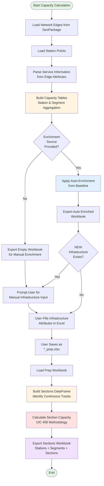

# Rail Network Capacity Calculation Methodology

**Document Version:** 1.0
**Last Updated:** 2025-01-20
**Implementation:** `infraScanRail/capacity_calculator.py`

---

## Table of Contents

1. [Overview](#overview)
2. [Capacity Calculation Process Flow](#capacity-calculation-process-flow)
3. [Phase 1: Data Input and Validation](#phase-1-data-input-and-validation)
4. [Phase 2: Capacity Table Construction](#phase-2-capacity-table-construction)
5. [Phase 3: Section Identification and Capacity Computation](#phase-3-section-identification-and-capacity-computation)
6. [UIC 406 Methodology Implementation](#uic-406-methodology-implementation)
7. [Enrichment Process](#enrichment-process)
8. [Output Structures](#output-structures)
9. [Key Functions Reference](#key-functions-reference)

---

## Overview

The capacity calculation methodology implements the **UIC 406 standard** for railway line capacity assessment, adapted for Swiss rail network analysis. The system processes rail network topology (edges and nodes) along with service patterns (frequency, stopping behavior) to compute capacity metrics at three levels:

- **Station Level**: Stopping and passing service frequencies aggregated by station
- **Segment Level**: Service frequencies aggregated by directed edge (from-to node pair)
- **Section Level**: Continuous track sections with homogeneous infrastructure characteristics

### Core Principles

1. **Infrastructure-Centric**: Capacity is determined by physical infrastructure (tracks, platforms, speeds)
2. **Service-Driven**: Current utilization measured by scheduled service frequencies
3. **Modular Enrichment**: Infrastructure attributes can be manually enriched or auto-enriched from baseline data
4. **Iterative Enhancement**: Supports capacity intervention workflows (Phase 4)

---

## Capacity Calculation Process Flow



---

## Phase 1: Data Input and Validation

### 1.1 Network Edges Loading

**Function:** `export_capacity_workbook()` (lines 1222-1372)

**Purpose:** Load rail network topology from GeoPackage file containing edges (segments) with service information.

**Input Data Structure:**
- **File Format:** GeoPackage (`.gpkg`)
- **Geometry Type:** LineString (rail segments)
- **Required Attributes:**
  - `FromNode`: Origin station ID
  - `ToNode`: Destination station ID
  - `Via`: Intermediate stopping station IDs (pipe-separated)
  - Service attributes: One column per service type (e.g., `IC1`, `RE2`, `S3`)
    - Values: Service frequency in trains per hour (tph)
    - `0` or empty: Service does not use this segment

**Key Operations:**
1. Load GeoPackage using GeoPandas (`gpd.read_file()`)
2. Extract node topology (FromNode, ToNode, Via)
3. Identify service columns (all non-geometry, non-topology columns)
4. Parse service frequencies for each edge

**Edge Cases Handled:**
- Missing `Via` column (assumes direct segments only)
- Empty service frequency fields (treated as 0 tph)
- Bidirectional edges (both directions represented)

---

### 1.2 Station Points Loading

**Function:** `export_capacity_workbook()` (lines 1250-1279)

**Purpose:** Load station point features to extract station metadata.

**Stations Loading Logic:**
- **Mode 1 - Development Workflow:** Uses NEW station set from development edges
- **Mode 2 - Baseline Workflows:** Loads from `points.gpkg` or `points_corridor.gpkg`

**Input Data Structure:**
- **File Format:** GeoPackage (`.gpkg`)
- **Geometry Type:** Point (station locations)
- **Required Attributes:**
  - `NR`: Unique station node ID
  - Optional: Station name, type, etc.

**Station Filtering:**
- Extracts unique station IDs from edges (FromNode, ToNode, Via)
- Matches with point features by `NR` field
- Identifies NEW stations (in edges but not in points.gpkg)

---

### 1.3 Service Information Parsing

**Function:** `export_capacity_workbook()` (lines 1280-1310)

**Purpose:** Parse service columns from edges to understand which services operate on which segments.

**Service Column Identification:**
```
Example service columns: IC1, IC2, RE1, RE2, S1, S2, S3
```

**Service Frequency Encoding:**
- **Value:** Frequency in trains per hour per direction (tphpd)
- **Example:** `IC1 = 2` means IC1 service runs 2 trains/hour/direction on this segment

**Data Quality Checks:**
- Validate numeric service frequencies
- Handle missing or null values (treat as 0)
- Detect inconsistent service patterns (warnings logged)

---

## Phase 2: Capacity Table Construction

### 2.1 Station-Level Aggregation

**Function:** `build_capacity_tables()` (lines 648-1032)

**Purpose:** Aggregate service frequencies at each station to determine stopping vs passing traffic.

**Process:**

#### Step 1: Initialize Station Metrics
- Create one row per unique station (`NR`)
- Initialize empty service lists for stopping and passing services

#### Step 2: Process Each Edge
For each edge (segment) in the network:

1. **Extract Nodes:**
   - Origin: `FromNode`
   - Destination: `ToNode`
   - Intermediate: Parse `Via` field (pipe-separated station IDs)

2. **Parse Service Patterns:**
   - For each service column with frequency > 0:
     - Service stops at FromNode (origin)
     - Service stops at ToNode (destination)
     - Service stops at all Via stations
     - Service passes through other stations on the route

3. **Aggregate Frequencies:**
   - **Stopping Services:** Add to `stopping_services` list with frequency
   - **Passing Services:** Add to `passing_services` list with frequency

#### Step 3: Compute Station-Level Metrics

**Output Columns:**
- `NR`: Station node ID
- `stopping_services`: Comma-separated list of stopping services (e.g., "IC1, S1, S2")
- `passing_services`: Comma-separated list of passing services (e.g., "IC2, RE1")
- `stopping_tphpd`: Total stopping trains per hour per direction
- `passing_tphpd`: Total passing trains per hour per direction
- `total_tphpd`: Sum of stopping and passing (total station load)
- `tracks`: Number of tracks (enriched later)
- `platforms`: Number of platforms (enriched later)

**Aggregation Logic:**
```
stopping_tphpd = sum(frequency for all stopping services)
passing_tphpd = sum(frequency for all passing services)
total_tphpd = stopping_tphpd + passing_tphpd
```

**Service String Format:**
```
"ServiceName, ServiceName, ServiceName"
Example: "IC1, IC2, S1"
```

---

### 2.2 Segment-Level Aggregation

**Function:** `build_capacity_tables()` (lines 648-1032)

**Purpose:** Aggregate service frequencies for each directed segment (edge) between stations.

**Process:**

#### Step 1: Initialize Segment Metrics
- Create one row per unique directed edge (`from_node` → `to_node`)
- Segment identifier: Ordered pair `(from_node, to_node)`

#### Step 2: Aggregate Service Frequencies
For each edge:

1. **Identify Segment:** Extract `(FromNode, ToNode)` pair
2. **Collect Services:** Find all services using this segment (frequency > 0)
3. **Sum Frequencies:** Add up frequencies for all services

#### Step 3: Compute Segment-Level Metrics

**Output Columns:**
- `from_node`: Origin station ID
- `to_node`: Destination station ID
- `services_tph`: Service-frequency pairs (e.g., "IC1.2, S1.6, S2.6")
- `total_tphpd`: Total trains per hour per direction on this segment
- `tracks`: Number of tracks (enriched later)
- `speed`: Design speed in km/h (enriched later)
- `length_m`: Segment length in meters (calculated from geometry)
- `travel_time_passing`: Travel time for passing trains in minutes (calculated later)

**Service-Frequency Format:**
```
"ServiceName.Frequency, ServiceName.Frequency"
Example: "IC1.2, IC2.2, S1.6"
```

**Total Frequency Calculation:**
```
total_tphpd = sum(frequency for all services on segment)
Example: 2 + 2 + 6 = 10 tphpd
```

---

### 2.3 Geometry-Based Calculations

**Function:** `build_capacity_tables()` (lines 822-850)

**Purpose:** Calculate segment length from geometry for travel time computation.

**Process:**

1. **Extract Geometry:** Get LineString geometry from GeoPackage
2. **Calculate Length:** Use GeoPandas length calculation
3. **Convert Units:**
   - Source: Coordinate reference system units (typically meters)
   - Target: Meters (stored in `length_m` column)

**Length Calculation:**
```
length_m = geometry.length  (assuming CRS in meters)
```

**Travel Time Calculation (Enriched Phase):**
```
travel_time_passing (minutes) = (length_m / 1000) / speed_kmh * 60
```

---

## Phase 3: Section Identification and Capacity Computation

### 3.1 Section Definition

**Function:** `_build_sections_dataframe()` (lines 71-296)

**Purpose:** Group consecutive segments with identical track counts into continuous "sections" for capacity analysis.

**Section Concept:**
A **section** is a sequence of one or more consecutive segments that share the same number of tracks. Capacity is constrained by the section with the lowest capacity, so sections are the fundamental unit for capacity assessment.

**Example:**
```
Station A (2 tracks) --- Segment 1 (2 tracks) --- Station B (2 tracks) --- Segment 2 (2 tracks) --- Station C (3 tracks)
                         └────────── Section 1 (2 tracks) ──────────┘

Station C (3 tracks) --- Segment 3 (2 tracks) --- Station D (2 tracks)
                         └─── Section 2 (2 tracks) ───┘
```

---

### 3.2 Section Identification Algorithm

**Function:** `_build_sections_dataframe()` (lines 71-296)

**Algorithm Steps:**

#### Step 1: Build Segment Network Graph
1. Create directed graph from segments (from_node → to_node)
2. Store track count for each edge
3. Identify connected components (continuous railway lines)

#### Step 2: Traverse Network to Identify Sections
For each continuous line:

1. **Start at Terminal Node:** Find node with no incoming or single outgoing edge
2. **Traverse Forward:** Follow edges until track count changes or terminal reached
3. **Create Section:** Group segments with same track count
4. **Repeat:** Continue from next track boundary

**Grouping Logic:**
```
If segment[i].tracks == segment[i+1].tracks:
    → Same section (continue)
Else:
    → New section (create boundary)
```

#### Step 3: Aggregate Section Attributes
For each identified section:

1. **Segment Sequence:** List of segment IDs in section (e.g., "8-10|10-12|12-15")
2. **Track Count:** Uniform track count across all segments
3. **Total Length:** Sum of segment lengths
4. **Service Frequencies:** Aggregate services across all segments
5. **Total TPHPD:** Sum of service frequencies

---

### 3.3 Section Capacity Calculation

**Function:** `_build_sections_dataframe()` (lines 180-250)

**Purpose:** Compute theoretical capacity for each section using UIC 406 methodology.

**UIC 406 Capacity Formula:**

```
Capacity (tphpd) = (60 / headway_minutes) × track_count × compression_factor
```

**Where:**
- `headway_minutes`: Minimum time separation between trains
- `track_count`: Number of tracks in section
- `compression_factor`: UIC 406 compression factor (0.75 for mixed traffic)

**Detailed Calculation (see section 6 for full methodology):**

#### Parameters:
1. **Base Headway:** Minimum headway from UIC tables (function of infrastructure)
2. **Heterogeneity Factor:** Adjustment for mixed service speeds/stopping patterns
3. **Buffer Time:** Additional separation for operational reliability
4. **Track Count Multiplier:** Linear scaling with number of tracks
5. **Compression Factor:** Non-linear reduction for practical scheduling constraints

**Implementation:**
The capacity calculation is performed by `_build_sections_dataframe()` which calls internal helper functions to:
1. Determine base headway from infrastructure parameters
2. Apply heterogeneity adjustments based on service mix
3. Scale by track count
4. Apply UIC 406 compression factor

**Output Metrics:**
- `Capacity`: Theoretical maximum capacity (tphpd)
- `total_tphpd`: Current utilization (scheduled services)
- `available_capacity`: Remaining capacity (Capacity - total_tphpd)
- `utilization_pct`: Utilization percentage ((total_tphpd / Capacity) × 100)

---

## UIC 406 Methodology Implementation

### 6.1 UIC 406 Overview

The **UIC Code 406** (Capacity) is the international standard for calculating railway line capacity established by the International Union of Railways (UIC). It provides a systematic methodology for determining how many trains can operate on a given rail infrastructure.

### 6.2 Core Capacity Concepts

#### 6.2.1 Theoretical Capacity

**Definition:** The maximum number of trains that can physically pass through a section in one hour under ideal conditions.

**Formula:**
```
Capacity_theoretical = 60 / minimum_headway
```

**Where:**
- `60`: Minutes per hour
- `minimum_headway`: Minimum time separation between trains (minutes)

#### 6.2.2 Practical Capacity

**Definition:** Realistic capacity accounting for operational constraints, heterogeneous traffic, and buffer times.

**UIC 406 Formula:**
```
Capacity_practical = Capacity_theoretical × compression_factor × track_multiplier
```

**Where:**
- `compression_factor`: 0.75 for mixed traffic (UIC standard)
- `track_multiplier`: Linear scaling for multi-track sections

---

### 6.3 Headway Calculation

**Function:** Referenced in `_build_sections_dataframe()` (lines 180-250)

**Base Headway Determination:**

Headway depends on:
1. **Signaling System:** Block spacing and signal aspects
2. **Train Performance:** Braking distances, acceleration/deceleration
3. **Speed:** Higher speeds require longer braking distances
4. **Track Occupancy Time:** Time a train occupies a block section

**Simplified Headway Model (Implementation):**
```
base_headway = (travel_time_passing × buffer_factor) + station_dwell_time
```

**Where:**
- `travel_time_passing`: Time for a train to traverse the section at design speed
- `buffer_factor`: 1.2 to 1.5 (safety margin for operational variability)
- `station_dwell_time`: Time trains occupy station platforms (if applicable)

---

### 6.4 Heterogeneity Adjustments

**Purpose:** Account for service mix with different speeds and stopping patterns.

**Heterogeneous Traffic Impact:**
- **Fast trains overtaking slow trains:** Reduces effective capacity
- **Mixed stopping patterns:** Requires flexible scheduling, reduces capacity
- **Different train lengths:** Impacts platform occupancy and track sectioning

**Adjustment Calculation:**
The implementation analyzes the ratio of stopping to passing services at stations to determine heterogeneity level. Higher heterogeneity reduces practical capacity.

**Heterogeneity Factor:**
```
If (stopping_services AND passing_services exist at same station):
    heterogeneity_factor = 0.85 to 0.95
Else:
    heterogeneity_factor = 1.0 (homogeneous traffic)
```

---

### 6.5 Track Count Scaling

**Single Track:**
```
Capacity_single = 60 / headway_minutes
```

**Double Track:**
```
Capacity_double = 2 × Capacity_single
```

**Multiple Tracks (n tracks):**
```
Capacity_n = n × Capacity_single × efficiency_factor
```

**Where:**
- `efficiency_factor`: 0.9 to 1.0 (slight reduction for operational complexity)

**Fractional Tracks (Passing Sidings):**
- **1.5 tracks:** Single track with passing siding
- **Capacity increase:** ~50% improvement over single track
- **Calculation:** `Capacity_1.5 = 1.5 × Capacity_single × siding_efficiency`

---

### 6.6 Compression Factor

**UIC 406 Standard Values:**
- **0.75:** Mixed traffic (passenger + freight, different speeds)
- **0.85:** Predominantly passenger traffic, similar speeds
- **0.90:** High-speed line, homogeneous traffic

**Implementation:**
The system uses `compression_factor = 0.75` as default for Swiss mixed-traffic rail networks.

**Purpose:**
Accounts for:
- **Scheduling inefficiencies:** Trains don't arrive perfectly evenly spaced
- **Operational delays:** Small delays propagate and reduce effective capacity
- **Maintenance windows:** Time must be reserved for track maintenance
- **Recovery margins:** Buffer time to absorb disruptions

---

### 6.7 Available Capacity Calculation

**Function:** Referenced in `identify_capacity_constrained_sections()` in `capacity_interventions.py`

**Formula:**
```
available_capacity = Capacity - total_tphpd
```

**Where:**
- `Capacity`: Theoretical capacity from UIC 406 calculation
- `total_tphpd`: Current scheduled service frequency

**Capacity States:**
- `available_capacity ≥ 2.0 tphpd`: **Sufficient capacity** (green)
- `0.0 < available_capacity < 2.0 tphpd`: **Constrained capacity** (yellow)
- `available_capacity ≤ 0.0 tphpd`: **Over-capacity** (red, requires intervention)

**Utilization Percentage:**
```
utilization_pct = (total_tphpd / Capacity) × 100
```

**Utilization Interpretation:**
- **< 50%:** Low utilization, ample capacity reserves
- **50-75%:** Moderate utilization, acceptable
- **75-90%:** High utilization, limited flexibility
- **> 90%:** Very high utilization, insufficient buffer for delays

---

## Enrichment Process

### 7.1 Manual Enrichment (Baseline Workflows)

**Purpose:** Populate infrastructure attributes that cannot be auto-calculated from network topology.

**User Workflow:**
1. **Export Empty Workbook:** System generates workbook with calculated service frequencies
2. **User Opens Excel:** Infrastructure columns (tracks, platforms, speed) are empty
3. **Manual Input:** User fills infrastructure attributes based on:
   - Infrastructure plans
   - Field surveys
   - Historical data
4. **Save as Prep Workbook:** User saves as `*_prep.xlsx`
5. **Sections Calculation:** System loads prep workbook and calculates sections

**Required Manual Fields:**

**Stations Sheet:**
- `tracks`: Number of tracks at station (float)
- `platforms`: Number of platforms (float)

**Segments Sheet:**
- `tracks`: Number of tracks on segment (float, can be fractional for passing sidings)
- `speed`: Design speed in km/h (integer)

**Validation Checkpoints:**
- System checks for NA/missing values
- Prompts user to complete enrichment before proceeding
- Blocks sections calculation if critical fields missing

---

### 7.2 Auto-Enrichment (Development Workflow)

**Function:** `apply_enrichment()` (lines 420-661)

**Purpose:** Automatically populate infrastructure attributes from baseline workbooks to minimize manual data entry for development scenarios.

**Process:**

#### Step 1: Load Baseline Data
1. **Baseline Prep Workbook:** Load manually enriched baseline infrastructure
2. **Enhanced Baseline Prep Workbook:** Load enhanced infrastructure with capacity interventions (optional)

#### Step 2: Build Lookup Dictionaries
Create fast lookup structures:
- **Station Lookup:** `{node_id: {tracks, platforms, stopping_tphpd, passing_tphpd}}`
- **Segment Lookup:** `{(from_node, to_node): {tracks, speed, length_m, total_tphpd}}`
- **Enhanced Station Lookup:** Enhanced infrastructure for selective application
- **Enhanced Segment Lookup:** Enhanced infrastructure for selective application

#### Step 3: Station Enrichment (Row-by-Row)

**For each development station:**

**Case A: Existing Station in Baseline**
1. **Calculate Development TPHPD:**
   ```
   dev_total_tphpd = dev_stopping_tphpd + dev_passing_tphpd
   ```

2. **Retrieve Baseline TPHPD:**
   ```
   baseline_total_tphpd = baseline_stopping_tphpd + baseline_passing_tphpd
   ```

3. **Compare Capacity Demand:**
   ```
   If dev_total_tphpd > baseline_total_tphpd:
       capacity_increased = True
   Else:
       capacity_increased = False
   ```

4. **Select Infrastructure Source:**
   - **If capacity_increased AND enhanced_baseline_exists:**
     ```
     Use enhanced_baseline.tracks
     Use enhanced_baseline.platforms
     ```
     *Rationale:* Increased traffic requires upgraded infrastructure

   - **If capacity_increased AND enhanced_baseline_missing:**
     ```
     Set tracks = NA
     Set platforms = NA
     ```
     *Rationale:* Manual input required for capacity increase without enhanced baseline

   - **If NOT capacity_increased:**
     ```
     Use baseline.tracks
     Use baseline.platforms
     ```
     *Rationale:* Existing infrastructure sufficient for unchanged/reduced traffic

**Case B: NEW Station (Not in Baseline)**
```
Set tracks = NA
Set platforms = NA
```
*Rationale:* No baseline data to inherit, requires manual input

#### Step 4: Segment Enrichment (Row-by-Row)

**For each development segment:**

**Case A: Existing Segment with No NEW Endpoints**
1. **Retrieve Development TPHPD:**
   ```
   dev_total_tphpd = segment.total_tphpd
   ```

2. **Retrieve Baseline TPHPD:**
   ```
   baseline_total_tphpd = baseline_segment.total_tphpd
   ```

3. **Compare Capacity Demand:**
   ```
   If dev_total_tphpd > baseline_total_tphpd:
       capacity_increased = True
   ```

4. **Select Infrastructure Source:**
   - **If capacity_increased AND enhanced_baseline_exists:**
     ```
     Use enhanced_baseline.tracks
     Use enhanced_baseline.speed
     Use enhanced_baseline.length_m
     Use enhanced_baseline.travel_time_passing
     ```

   - **If capacity_increased AND enhanced_baseline_missing:**
     ```
     Set tracks = NA
     Set speed = NA
     Set length_m = NA
     Set travel_time_passing = NA
     ```

   - **If NOT capacity_increased:**
     ```
     Use baseline.tracks
     Use baseline.speed
     Use baseline.length_m
     Use baseline.travel_time_passing
     ```

**Case B: NEW Segment or Segment with NEW Endpoint**
```
Set tracks = NA
Set speed = NA
Calculate length_m from geometry (if available)
```

#### Step 5: Export and Manual Completion
1. **Export Auto-Enriched Workbook:** Most infrastructure pre-filled
2. **User Fills NA Values:** Only NEW infrastructure requires manual input
3. **Save as Prep Workbook:** Complete enrichment process

**Auto-Enrichment Summary Statistics:**
The function logs:
- Number of stations auto-enriched from baseline
- Number of stations using enhanced baseline
- Number of stations requiring manual input
- Number of segments auto-enriched from baseline
- Number of segments using enhanced baseline
- Number of segments requiring manual input

---

### 7.3 Selective Enhanced Enrichment Logic

**Key Innovation:** Development workflow intelligently selects between baseline and enhanced infrastructure based on **capacity demand changes**, not service name changes.

**Comparison Methodology:**

**OLD (Incorrect) Approach:**
```
Compare service names (string comparison)
If NEW service added → Use enhanced infrastructure
```
**Problem:** Missed frequency increases for existing services

**NEW (Correct) Approach:**
```
Compare total TPHPD (numeric comparison)
If dev_total_tphpd > baseline_total_tphpd → Use enhanced infrastructure
```
**Benefit:** Detects all capacity increases (new services, frequency increases, etc.)

**Example Scenario:**

**Baseline:**
- Services: IC1 (2 tph), S1 (6 tph)
- Total: 8 tphpd
- Infrastructure: 2 tracks

**Development:**
- Services: IC1 (2 tph), S1 (10 tph)  ← Frequency increased
- Total: 12 tphpd
- Infrastructure needed: 3 tracks (from enhanced baseline)

**Result:**
```
12 tphpd > 8 tphpd → capacity_increased = True
→ Use enhanced baseline infrastructure (3 tracks)
```

---

## Output Structures

### 8.1 Capacity Workbook (`*_network.xlsx`)

**Generated by:** `export_capacity_workbook()`

**Purpose:** Initial workbook with calculated service frequencies, before manual enrichment.

**Sheets:**

#### Sheet 1: Stations
| Column | Type | Description |
|--------|------|-------------|
| `NR` | int | Station node ID |
| `stopping_services` | str | Comma-separated list of stopping services |
| `passing_services` | str | Comma-separated list of passing services |
| `stopping_tphpd` | float | Total stopping trains per hour per direction |
| `passing_tphpd` | float | Total passing trains per hour per direction |
| `total_tphpd` | float | Total station traffic load |
| `tracks` | float | Number of tracks (empty for manual enrichment) |
| `platforms` | float | Number of platforms (empty for manual enrichment) |

#### Sheet 2: Segments
| Column | Type | Description |
|--------|------|-------------|
| `from_node` | int | Origin station ID |
| `to_node` | int | Destination station ID |
| `services_tph` | str | Service-frequency pairs (e.g., "IC1.2, S1.6") |
| `total_tphpd` | float | Total trains per hour per direction on segment |
| `tracks` | float | Number of tracks (empty for manual enrichment) |
| `speed` | int | Design speed in km/h (empty for manual enrichment) |
| `length_m` | float | Segment length in meters (calculated from geometry) |
| `travel_time_passing` | float | Travel time for passing trains in minutes (calculated after enrichment) |

---

### 8.2 Prep Workbook (`*_network_prep.xlsx`)

**Generated by:** User saves manually enriched workbook

**Purpose:** Completed workbook with all infrastructure attributes filled, ready for sections calculation.

**Structure:** Same as Capacity Workbook, but with all infrastructure columns populated.

**Validation:** System checks for NA values before proceeding to sections calculation.

---

### 8.3 Sections Workbook (`*_network_sections.xlsx`)

**Generated by:** `_build_sections_dataframe()` and sections export logic

**Purpose:** Complete capacity analysis with section-level capacity calculations.

**Sheets:**

#### Sheet 1: Stations
Same as Prep Workbook

#### Sheet 2: Segments
Same as Prep Workbook

#### Sheet 3: Sections
| Column | Type | Description |
|--------|------|-------------|
| `section_id` | str | Unique section identifier |
| `segment_sequence` | str | Pipe-separated segment IDs (e.g., "8-10\|10-12") |
| `tracks` | float | Uniform track count for section |
| `total_length_m` | float | Total section length in meters |
| `total_tphpd` | float | Total service frequency on section |
| `Capacity` | float | Theoretical capacity (tphpd) from UIC 406 |
| `available_capacity` | float | Remaining capacity (Capacity - total_tphpd) |
| `utilization_pct` | float | Utilization percentage |

**Section-Level Metrics Enable:**
- Identification of capacity bottlenecks
- Targeted intervention design (Phase 4)
- Network-wide capacity visualization
- Economic analysis of capacity constraints

---

## Key Functions Reference

### 9.1 Core Calculation Functions

#### `export_capacity_workbook()`
**Location:** `capacity_calculator.py` lines 1222-1372
**Purpose:** Main orchestration function for capacity table generation
**Parameters:**
- `edges_path`: Path to network edges GeoPackage (optional for baseline)
- `network_label`: Network identifier (optional, uses settings.rail_network)
- `enrichment_source`: Path to baseline prep for auto-enrichment (optional)
- `skip_manual_checkpoint`: Whether to prompt user for manual enrichment

**Returns:** Path to generated capacity workbook

---

#### `build_capacity_tables()`
**Location:** `capacity_calculator.py` lines 648-1032
**Purpose:** Aggregate service frequencies at station and segment levels
**Parameters:**
- `edges_gdf`: GeoDataFrame of network edges
- `service_cols`: List of service column names

**Returns:** Tuple of (stations_df, segments_df)

**Key Operations:**
- Service pattern parsing
- Station-level aggregation (stopping/passing)
- Segment-level aggregation (total TPHPD)
- Geometry-based length calculation

---

#### `_build_sections_dataframe()`
**Location:** `capacity_calculator.py` lines 71-296
**Purpose:** Identify continuous track sections and calculate capacity
**Parameters:**
- `stations_df`: Stations DataFrame with enriched infrastructure
- `segments_df`: Segments DataFrame with enriched infrastructure

**Returns:** Sections DataFrame with capacity metrics

**Key Operations:**
- Network graph construction
- Section boundary identification
- UIC 406 capacity calculation
- Available capacity computation

---

### 9.2 Enrichment Functions

#### `apply_enrichment()`
**Location:** `capacity_calculator.py` lines 420-661
**Purpose:** Auto-enrich infrastructure from baseline for development workflow
**Parameters:**
- `stations_df`: Development stations (empty infrastructure)
- `segments_df`: Development segments (empty infrastructure)
- `baseline_prep`: Path to baseline prep workbook
- `edges_gdf`: Development edges GeoDataFrame
- `new_station_ids`: Set of NEW station IDs
- `enhanced_prep`: Path to enhanced baseline prep (optional)

**Returns:** Tuple of (enriched_stations_df, enriched_segments_df)

**Key Operations:**
- Baseline data loading
- Enhanced baseline data loading (optional)
- TPHPD comparison (development vs baseline)
- Selective infrastructure assignment
- NA flagging for manual input

---

### 9.3 Utility Functions

#### `_derive_prep_path()`
**Location:** `capacity_calculator.py` lines 35-47
**Purpose:** Derive prep workbook path from capacity workbook path
**Parameters:**
- `network_workbook_path`: Path to capacity workbook

**Returns:** Path to prep workbook (`*_network_prep.xlsx`)

---

#### `_derive_sections_path()`
**Location:** `capacity_calculator.py` lines 50-62
**Purpose:** Derive sections workbook path from capacity workbook path
**Parameters:**
- `network_workbook_path`: Path to capacity workbook

**Returns:** Path to sections workbook (`*_network_sections.xlsx`)

---

### 9.4 Helper Functions

#### Network Topology Parsing
**Location:** `capacity_calculator.py` lines 650-750
**Purpose:** Parse FromNode, ToNode, Via attributes from edges
**Operations:**
- Node ID extraction
- Via field parsing (pipe-separated IDs)
- Station set construction

---

#### Service Frequency Parsing
**Location:** `capacity_calculator.py` lines 750-850
**Purpose:** Parse service columns and frequencies from edges
**Operations:**
- Service column identification
- Frequency value extraction
- Service-to-segment mapping

---

#### Geometry Calculations
**Location:** `capacity_calculator.py` lines 850-920
**Purpose:** Calculate geometric properties from GeoPackage
**Operations:**
- Segment length calculation
- Coordinate reference system handling
- Unit conversions

---

## Summary

The capacity calculation methodology provides a robust, standards-based framework for assessing rail network capacity at multiple levels (station, segment, section). The implementation:

1. **Adheres to UIC 406 Standards:** International best practices for capacity calculation
2. **Supports Multiple Workflows:** Baseline, development, and enhanced capacity analysis
3. **Enables Auto-Enrichment:** Minimizes manual data entry for development scenarios
4. **Provides Detailed Metrics:** Station, segment, and section-level capacity insights
5. **Facilitates Intervention Design:** Identifies capacity constraints for targeted improvements

The modular architecture separates calculation logic (`capacity_calculator.py`) from workflow orchestration (`run_capacity_analysis.py`) and intervention design (`capacity_interventions.py`), enabling flexible application across diverse rail network analysis scenarios.

---

**Related Documentation:**
- [Capacity Workflows Documentation](CAPACITY_WORKFLOWS_DOCUMENTATION.md) - Detailed workflow descriptions
- `infraScanRail/capacity_calculator.py` - Implementation source code
- `infraScanRail/run_capacity_analysis.py` - Workflow orchestration
- `infraScanRail/capacity_interventions.py` - Phase 4 interventions
