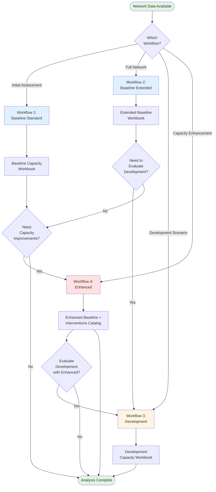
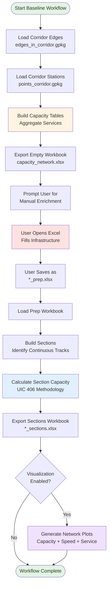
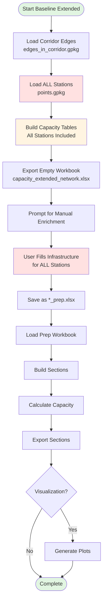
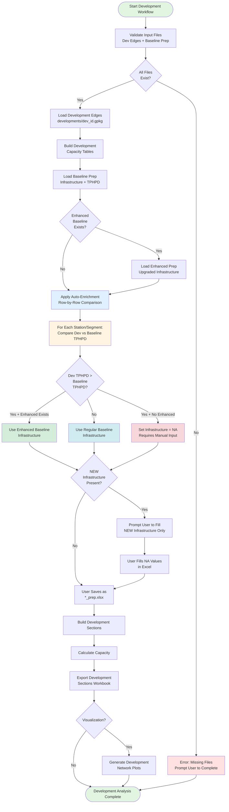
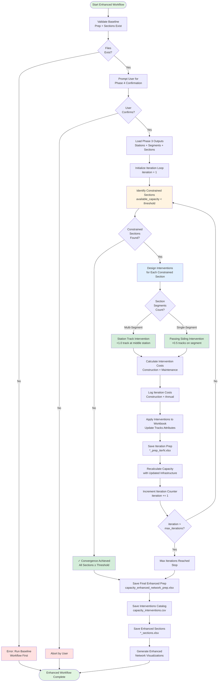
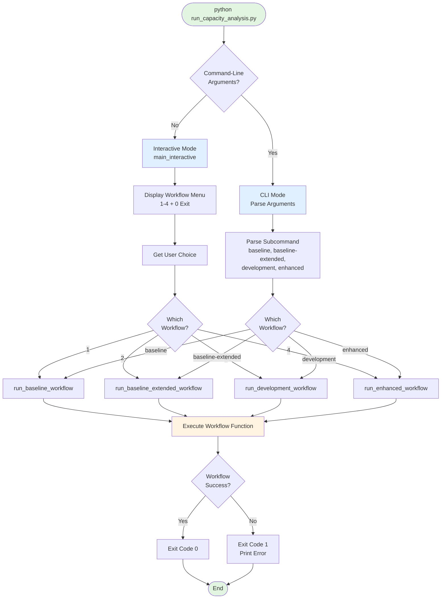
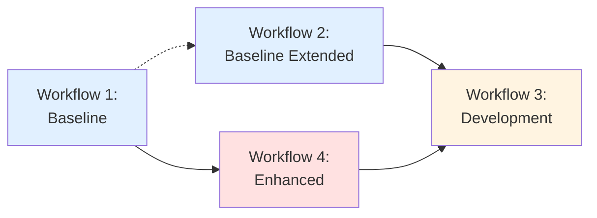

# Rail Network Capacity Analysis Workflows

**Document Version:** 1.0
**Last Updated:** 2025-01-20
**Implementation:** `infraScanRail/run_capacity_analysis.py`, `infraScanRail/capacity_interventions.py`

---

## Table of Contents

1. [Overview](#overview)
2. [Workflow Architecture](#workflow-architecture)
3. [Workflow 1: Baseline (Standard)](#workflow-1-baseline-standard)
4. [Workflow 2: Baseline Extended](#workflow-2-baseline-extended)
5. [Workflow 3: Development](#workflow-3-development)
6. [Workflow 4: Enhanced (Phase 4 Interventions)](#workflow-4-enhanced-phase-4-interventions)
7. [Workflow Orchestration](#workflow-orchestration)
8. [User Interaction Modes](#user-interaction-modes)
9. [Output Files and Visualization](#output-files-and-visualization)
10. [Workflow Dependencies](#workflow-dependencies)

---

## Overview

The rail network capacity analysis system provides four integrated workflows for assessing and enhancing railway capacity. Each workflow serves a specific purpose in the capacity planning lifecycle:

| Workflow | Purpose | Input | Output | Use Case |
|----------|---------|-------|--------|----------|
| **1. Baseline** | Establish baseline capacity for corridor-filtered network | Corridor edges + stations | Baseline capacity workbook | Initial capacity assessment |
| **2. Baseline Extended** | Establish baseline capacity for full network | All edges + all stations | Extended baseline workbook | Comprehensive network analysis |
| **3. Development** | Evaluate development scenarios with auto-enrichment | Development edges + baseline prep | Development capacity workbook | Project evaluation |
| **4. Enhanced** | Design capacity interventions to meet targets | Baseline sections | Enhanced baseline + interventions catalog | Capacity improvement planning |

### Key Principles

1. **Progressive Enhancement:** Each workflow builds on previous outputs
2. **Manual + Auto Enrichment:** Balance automation with domain expertise
3. **Standardized Outputs:** Consistent structure enables comparison
4. **Iterative Refinement:** Workflows support multiple runs with adjustments

---

## Workflow Architecture



---

## Workflow 1: Baseline (Standard)

### Purpose
Establish baseline capacity metrics for a **corridor-filtered** rail network. This workflow focuses on stations within a defined corridor boundary, providing targeted capacity analysis for a specific geographic region.

### Input Requirements

**Network Data:**
- **Edges:** `data/Network/processed/edges_in_corridor.gpkg`
  - Corridor-filtered rail segments
- **Stations:** `data/Network/processed/points_corridor.gpkg`
  - Stations within corridor boundary

**Configuration:**
- `settings.rail_network`: Network identifier (e.g., "AK_2035")

### Process Flow



### Key Functions

#### `run_baseline_workflow()`
**Location:** `run_capacity_analysis.py` lines 42-136
**Purpose:** Orchestrate baseline workflow from start to finish

**Process Steps:**
1. **Set Network Context:** Temporarily set `settings.rail_network` to specified network label
2. **Generate Capacity Workbook:** Call `export_capacity_workbook()` with baseline mode
3. **Manual Enrichment Checkpoint:** Prompt user to fill infrastructure attributes
4. **Validate Sections:** Check if sections workbook was generated
5. **Generate Visualizations:** Create capacity, speed, and service network plots
6. **Report Outputs:** Print file paths and completion summary

**Parameters:**
- `network_label`: Network identifier (default: `settings.rail_network`)
- `visualize`: Whether to generate plots (default: True)

### Manual Enrichment Process

**User Actions:**
1. Open `capacity_{network}_network.xlsx` in Excel
2. Fill **Stations** sheet:
   - `tracks`: Number of tracks (e.g., 2.0)
   - `platforms`: Number of platforms (e.g., 2.0)
3. Fill **Segments** sheet:
   - `tracks`: Number of tracks (e.g., 1.0, 1.5 for passing siding, 2.0 for double track)
   - `speed`: Design speed in km/h (e.g., 160)
4. Save as `capacity_{network}_network_prep.xlsx`
5. Re-run workflow to generate sections

**Validation:**
- System checks for NA values in required columns
- Blocks sections calculation if critical infrastructure missing
- Provides clear error messages guiding user to complete enrichment

### Outputs

**Directory:** `data/Network/capacity/Baseline/{network_label}/`

**Files:**
1. `capacity_{network}_network.xlsx` - Initial workbook with empty infrastructure
2. `capacity_{network}_network_prep.xlsx` - User-enriched workbook
3. `capacity_{network}_network_sections.xlsx` - Complete capacity analysis with sections

**Plots:** `plots/network/{network_label}/`
- `capacity_network.png` - Track counts and capacity utilization
- `speed_profile.png` - Design speeds by segment
- `service_network.png` - Service frequencies and stopping patterns

---

## Workflow 2: Baseline Extended

### Purpose
Establish baseline capacity metrics for the **full rail network** without corridor filtering. This workflow includes all stations in the network, providing comprehensive capacity analysis for network-wide planning.

### Differences from Baseline Standard

| Aspect | Baseline Standard | Baseline Extended |
|--------|------------------|-------------------|
| **Stations** | Corridor-filtered (`points_corridor.gpkg`) | All stations (`points.gpkg`) |
| **Network Label** | `{rail_network}` | `{rail_network}_extended` |
| **Use Case** | Regional corridor analysis | Network-wide planning |
| **Output Directory** | `capacity/Baseline/{network}/` | `capacity/Baseline/{network}_extended/` |

### Process Flow



### Key Functions

#### `run_baseline_extended_workflow()`
**Location:** `run_capacity_analysis.py` lines 139-234
**Purpose:** Orchestrate baseline extended workflow

**Key Difference:**
- Uses `points.gpkg` instead of `points_corridor.gpkg`
- Network label defaults to `{settings.rail_network}_extended`

**Process:** Identical to Baseline Standard, but with full station set

### Use Cases

1. **Network-Wide Capacity Assessment:** Understand capacity across entire rail system
2. **Development Workflow Preparation:** Extended baseline serves as base for development scenarios
3. **Regional Comparison:** Compare corridor capacity to broader network context
4. **Long-Term Planning:** Inform strategic network development decisions

### Outputs

**Directory:** `data/Network/capacity/Baseline/{network_label}_extended/`

**Files:** Same structure as Baseline Standard, with "_extended" suffix

---

## Workflow 3: Development

### Purpose
Evaluate capacity for a **specific development scenario** by combining development-specific network edges with auto-enriched infrastructure from baseline workbooks. This workflow minimizes manual data entry by intelligently inheriting infrastructure attributes.

### Key Innovation: Auto-Enrichment with Selective Enhanced Infrastructure

The development workflow automatically populates infrastructure attributes using:
- **Baseline Infrastructure** for segments/stations with unchanged capacity demand
- **Enhanced Baseline Infrastructure** for segments/stations with increased capacity demand
- **Manual Input** only for genuinely NEW infrastructure

### Input Requirements

**Development Data:**
- **Development Edges:** `data/Network/processed/developments/{dev_id}.gpkg`
  - Network edges specific to the development scenario

**Baseline Data:**
- **Baseline Prep Workbook:** `data/Network/capacity/Baseline/{base_network}/capacity_{base_network}_network_prep.xlsx`
  - Manually enriched baseline infrastructure
- **Enhanced Baseline Prep Workbook** (optional): `data/Network/capacity/Enhanced/{base_network}_enhanced/capacity_{base_network}_enhanced_network_prep.xlsx`
  - Enhanced infrastructure with capacity interventions

**Configuration:**
- `dev_id`: Development identifier (e.g., "101032.0") - **Required**
- `base_network`: Base network label (default: `{settings.rail_network}_extended`)

### Process Flow



### Key Functions

#### `run_development_workflow()`
**Location:** `run_capacity_analysis.py` lines 237-362
**Purpose:** Orchestrate development workflow with auto-enrichment

**Process Steps:**
1. **Validate Prerequisites:**
   - Check development edges file exists
   - Check baseline prep workbook exists
   - Provide clear error messages if missing

2. **Construct Network Label:**
   ```
   network_label = f"{base_network}_dev_{dev_id}"
   Example: "AK_2035_extended_dev_101032.0"
   ```

3. **Call Auto-Enrichment:**
   - Pass `enrichment_source=baseline_prep_path` to `export_capacity_workbook()`
   - Auto-detect enhanced baseline path
   - Trigger `apply_enrichment()` function

4. **Manual Completion (if needed):**
   - Prompt user to fill NEW infrastructure
   - Wait for user to save prep workbook

5. **Sections Calculation:**
   - Load prep workbook
   - Build sections with development infrastructure
   - Calculate capacity metrics

6. **Visualization:**
   - Generate development-specific plots
   - Save to `plots/network/Developments/{dev_id}/`

#### `apply_enrichment()`
**Location:** `capacity_calculator.py` lines 420-661
**Purpose:** Auto-enrich infrastructure from baseline with selective enhanced baseline usage

**Enrichment Logic:**

**For each station:**
1. Calculate `dev_total_tphpd = dev_stopping_tphpd + dev_passing_tphpd`
2. Calculate `baseline_total_tphpd = baseline_stopping_tphpd + baseline_passing_tphpd`
3. Compare:
   - **If `dev_total_tphpd > baseline_total_tphpd` AND enhanced exists:** Use enhanced infrastructure
   - **If `dev_total_tphpd > baseline_total_tphpd` AND no enhanced:** Set NA (manual input)
   - **If `dev_total_tphpd ≤ baseline_total_tphpd`:** Use baseline infrastructure
4. Special case: NEW stations (not in baseline) → Set NA

**For each segment:**
1. Compare `dev_total_tphpd` vs `baseline_total_tphpd`
2. Same decision tree as stations
3. Special case: NEW segments or segments with NEW endpoints → Set NA

**Why TPHPD Comparison (Not Service Names)?**

**Correct Approach (Current):**
```
Dev: IC1.2, S1.10 → total_tphpd = 12
Baseline: IC1.2, S1.6 → total_tphpd = 8
Result: 12 > 8 → Use enhanced infrastructure
```

**Incorrect Approach (Previous):**
```
Dev services: {IC1, S1}
Baseline services: {IC1, S1}
Set difference: {} (no new services)
Result: Use baseline infrastructure (WRONG - misses frequency increase!)
```

**Benefits of TPHPD Comparison:**
- ✅ Detects frequency increases for existing services
- ✅ Detects new services added
- ✅ Detects service removals (reduced demand)
- ✅ Robust to formatting differences
- ✅ Purely numeric comparison (no string parsing)

### Outputs

**Directory:** `data/Network/capacity/Developments/{dev_id}/`

**Files:**
1. `capacity_{base_network}_dev_{dev_id}_network.xlsx` - Auto-enriched workbook
2. `capacity_{base_network}_dev_{dev_id}_network_prep.xlsx` - User-completed workbook
3. `capacity_{base_network}_dev_{dev_id}_network_sections.xlsx` - Development capacity analysis

**Plots:** `plots/network/Developments/{dev_id}/`
- Development-specific capacity, speed, and service plots

### User Interaction

**Minimal Manual Input:**
- If all infrastructure inherited from baseline → No manual input required
- If NEW stations/segments present → User fills only NA values
- If capacity increased without enhanced baseline → User fills NA values

**Example Scenario:**

**Development adds:**
- NEW service S5 on existing segments (6 tph)
- NEW station at node 999
- Frequency increase for S1 (6 → 10 tph)

**Auto-Enrichment Result:**
- Existing segments with S1 frequency increase → Enhanced infrastructure (if available)
- NEW station 999 → NA (user fills tracks, platforms)
- Existing segments with NEW service S5 → Enhanced infrastructure (if available)

---

## Workflow 4: Enhanced (Phase 4 Interventions)

### Purpose
Design and implement **capacity interventions** to bring all track sections to a minimum available capacity threshold (default: ≥2 tphpd). This workflow uses an iterative approach to identify constrained sections, design targeted interventions, and recalculate capacity until convergence.

### Intervention Types

| Intervention | Tracks Added | Application | Cost Basis |
|-------------|--------------|-------------|------------|
| **Station Track** | +1.0 track | Multi-segment sections | Fixed cost per station |
| **Passing Siding** | +0.5 tracks | Single-segment sections | Cost per km of segment |

### Input Requirements

**Baseline Data:**
- **Prep Workbook:** `data/Network/capacity/Baseline/{network}/capacity_{network}_network_prep.xlsx`
  - Baseline infrastructure attributes
- **Sections Workbook:** `data/Network/capacity/Baseline/{network}/capacity_{network}_network_sections.xlsx`
  - Baseline capacity analysis with section definitions

**Configuration:**
- `network_label`: Base network identifier (default: `settings.rail_network`)
- `threshold`: Minimum required available capacity in tphpd (default: 2.0)
- `max_iterations`: Maximum intervention iterations (default: 10)

### Process Flow



### Key Functions

#### `run_enhanced_workflow()`
**Location:** `run_capacity_analysis.py` lines 365-488
**Purpose:** Orchestrate Phase 4 enhanced capacity workflow

**Process Steps:**
1. **Validate Prerequisites:**
   - Check baseline prep workbook exists
   - Check sections workbook exists
   - Provide clear instructions if missing

2. **User Confirmation:**
   - Prompt: "Proceed with Phase 4 execution? (y/n)"
   - Allow user to abort before expensive computation

3. **Load Phase 3 Outputs:**
   - Stations DataFrame from prep workbook
   - Segments DataFrame from prep workbook
   - Sections DataFrame from sections workbook

4. **Execute Phase 4:**
   - Call `run_phase_four()` with loaded data
   - Receive interventions catalog, enhanced prep path, final sections

5. **Generate Visualizations:**
   - Call `visualize_enhanced_network()`
   - Create infrastructure and capacity plots

6. **Report Outputs:**
   - List all generated files
   - Summarize interventions and costs

#### `run_phase_four()`
**Location:** `capacity_interventions.py` lines 391-520
**Purpose:** Execute iterative capacity intervention process

**Iteration Loop:**
```
For iteration = 1 to max_iterations:
    1. Identify constrained sections (available_capacity < threshold)
    2. If none found → Break (convergence achieved)
    3. Design interventions for each constrained section
    4. Calculate intervention costs
    5. Apply interventions to workbook (update tracks)
    6. Recalculate capacity with updated infrastructure
    7. Update current_prep_path for next iteration
    8. Append interventions to catalog
```

**Outputs:**
- **interventions_catalog:** List of all interventions applied
- **enhanced_prep_path:** Path to final enhanced prep workbook
- **final_sections_df:** Final sections with enhanced capacity

#### `identify_capacity_constrained_sections()`
**Location:** `capacity_interventions.py` lines 77-113
**Purpose:** Find sections below capacity threshold

**Logic:**
```
available_capacity = Capacity - total_tphpd
constrained_sections = sections where available_capacity < threshold
```

**Example:**
```
Section A: Capacity = 8 tphpd, total_tphpd = 6 → available = 2 → OK
Section B: Capacity = 7 tphpd, total_tphpd = 6 → available = 1 → CONSTRAINED
Section C: Capacity = 10 tphpd, total_tphpd = 8 → available = 2 → OK
```

#### `design_section_intervention()`
**Location:** `capacity_interventions.py` lines 116-208
**Purpose:** Design appropriate intervention for a constrained section

**Decision Logic:**

**Multi-Segment Section:**
```
Segments in section: 3 or more
Intervention: Station track at middle station
Rationale: Adding track at middle station benefits all segments in section
Example: Section with segments [A-B, B-C, C-D] → Add track at station C
Tracks added: +1.0 track at station
```

**Single-Segment Section:**
```
Segments in section: 1
Intervention: Passing siding on segment
Rationale: Only one segment to improve, passing siding is cost-effective
Example: Section with segment [A-B] → Add passing siding on A-B
Tracks added: +0.5 tracks on segment
```

**Intervention Object:**
```
CapacityIntervention(
    intervention_id: Unique ID (e.g., "INT_ST_0001", "INT_PS_0042")
    section_id: Section requiring intervention
    type: "station_track" or "segment_passing_siding"
    node_id: Station ID (for station track)
    segment_id: Segment ID (for passing siding)
    tracks_added: 1.0 or 0.5
    affected_segments: List of segment IDs benefiting from intervention
    construction_cost_chf: Calculated cost
    maintenance_cost_annual_chf: Annual maintenance cost
    length_m: Segment length (for passing sidings)
    iteration: Iteration number when applied
)
```

#### `calculate_intervention_cost()`
**Location:** `capacity_interventions.py` lines 211-246
**Purpose:** Calculate construction and annual maintenance costs

**Cost Parameters (from `cost_parameters.py`):**
- `station_track_cost_chf`: Fixed cost per station track addition
- `passing_siding_cost_chf_per_km`: Cost per kilometer for passing siding
- `yearly_maintenance_to_construction_cost_factor`: Annual maintenance as fraction of construction cost

**Calculation:**

**Station Track:**
```
construction_cost = station_track_cost_chf
maintenance_cost_annual = construction_cost × maintenance_factor
```

**Passing Siding:**
```
length_km = segment_length_m / 1000
construction_cost = passing_siding_cost_chf_per_km × length_km
maintenance_cost_annual = construction_cost × maintenance_factor
```

#### `apply_interventions_to_workbook()`
**Location:** `capacity_interventions.py` lines 249-313
**Purpose:** Update prep workbook with intervention track adjustments

**Process:**
1. Load baseline prep workbook (Stations + Segments sheets)
2. For each intervention:
   - **Station Track:** Find station by `node_id`, add 1.0 to `tracks` column
   - **Passing Siding:** Find segment by `(from_node, to_node)`, add 0.5 to `tracks` column
3. Save enhanced prep workbook with updated tracks
4. Log changes for user visibility

**Example Track Updates:**
```
Station 123: 2.0 tracks → 3.0 tracks (+1.0 station track)
Segment 45-67: 1.0 tracks → 1.5 tracks (+0.5 passing siding)
```

#### `recalculate_enhanced_capacity()`
**Location:** `capacity_interventions.py` lines 316-342
**Purpose:** Recalculate sections and capacity after interventions

**Process:**
1. Load enhanced prep workbook with updated tracks
2. Call `_build_sections_dataframe()` to rebuild sections
3. Recalculate capacity with new track counts
4. Return updated sections DataFrame

**Result:**
- Sections may merge/split based on new track boundaries
- Capacity values increase due to added tracks
- Available capacity improves for intervened sections

#### `visualize_enhanced_network()`
**Location:** `capacity_interventions.py` lines 345-388
**Purpose:** Generate infrastructure and capacity plots for enhanced network

**Plots Generated:**
1. **Infrastructure Plot:** Shows track counts with interventions highlighted
2. **Capacity Plot:** Shows available capacity after enhancements

**Output Directory:** `plots/network/{network_label}_enhanced/`

### Iterative Convergence

**Convergence Criteria:**
```
All sections have available_capacity ≥ threshold
```

**Why Multiple Iterations?**
1. **Cascading Effects:** Adding tracks to one section may create new bottlenecks downstream
2. **Section Redefinition:** Track additions change section boundaries, creating new sections
3. **Service Redistribution:** Capacity improvements may enable service reallocation

**Example Convergence:**
```
Iteration 1:
- 15 constrained sections identified
- 15 interventions designed (10 station tracks, 5 passing sidings)
- Applied to workbook, recalculated capacity
- Result: 7 sections still constrained

Iteration 2:
- 7 constrained sections identified
- 7 interventions designed (4 station tracks, 3 passing sidings)
- Applied to workbook, recalculated capacity
- Result: 2 sections still constrained

Iteration 3:
- 2 constrained sections identified
- 2 interventions designed (2 station tracks)
- Applied to workbook, recalculated capacity
- Result: 0 sections constrained

✓ Convergence achieved after 3 iterations
Total interventions: 24 (16 station tracks, 8 passing sidings)
```

### Outputs

**Directory:** `data/Network/capacity/Enhanced/{network}_enhanced/`

**Files:**
1. **Iteration Prep Files:**
   - `capacity_AK_2035_enhanced_network_prep_iter1.xlsx`
   - `capacity_AK_2035_enhanced_network_prep_iter2.xlsx`
   - `capacity_AK_2035_enhanced_network_prep_iterN.xlsx`

2. **Final Enhanced Prep:**
   - `capacity_AK_2035_enhanced_network_prep.xlsx`

3. **Interventions Catalog:**
   - `capacity_interventions.csv`
   - Columns: intervention_id, section_id, type, node_id, segment_id, tracks_added, affected_segments, construction_cost_chf, maintenance_cost_annual_chf, length_m, iteration

4. **Enhanced Sections:**
   - `capacity_AK_2035_enhanced_network_sections.xlsx`
   - Sheets: Stations, Segments, Sections (with enhanced capacity)

**Plots:** `plots/network/{network}_enhanced/`
- Infrastructure plot showing interventions
- Capacity plot showing improved available capacity

### Cost Summary

**Reported Metrics:**
- Total interventions count (by type)
- Total construction cost (CHF)
- Total annual maintenance cost (CHF)
- Cost per iteration (for tracking convergence speed)

**Example Output:**
```
Phase 4 Complete!
Total iterations: 3
Total interventions: 24
  - 16 station tracks
  - 8 passing sidings
Total construction cost: 145,000,000 CHF
Total annual maintenance: 2,175,000 CHF
```

---

## Workflow Orchestration

### CLI Orchestrator: `run_capacity_analysis.py`

**Purpose:** Unified command-line interface for all four workflows

**Architecture:**
- **Main Entry Point:** `main()` function (lines 585-723)
- **Interactive Mode:** `main_interactive()` function (lines 491-583)
- **CLI Mode:** argparse-based subcommands
- **Workflow Functions:** Individual functions for each workflow

### Orchestration Flow



### Network Label Configuration

**Default Behavior (using `settings.rail_network`):**
- **Baseline:** Uses `settings.rail_network`
- **Baseline Extended:** Uses `{settings.rail_network}_extended`
- **Development:** Uses `{settings.rail_network}_extended` as base network
- **Enhanced:** Uses `settings.rail_network`

**User Overrides:**
- **CLI Mode:** Specify `--network` argument
- **Interactive Mode:** Enter custom network label (or press Enter for default)

**Example:**
```bash
# Uses settings.rail_network (e.g., "AK_2035")
python run_capacity_analysis.py baseline

# Override with custom network
python run_capacity_analysis.py baseline --network MY_2040_NETWORK
```

---

## User Interaction Modes

### Interactive Mode

**Launch:**
```bash
python run_capacity_analysis.py
```

**Features:**
- Menu-driven workflow selection
- Prompts for all required parameters
- Shows default values from `settings.py`
- User-friendly error messages
- Confirmation prompts for expensive operations

**Example Session:**
```
======================================================================
RAIL NETWORK CAPACITY ANALYSIS TOOL
======================================================================

Available Workflows:
  1. Baseline - Standard baseline (corridor-filtered stations)
  2. Baseline Extended - All stations (no corridor filtering)
  3. Development - Development network with auto-enrichment
  4. Enhanced - Phase 4 capacity interventions
  0. Exit
======================================================================

Select workflow (0-4): 3

--- Development Workflow Configuration ---
Development ID (e.g., 101032.0): 101032.0
Base network label [AK_2035_extended]:
Generate visualizations? (y/n) [y]: y

[Workflow executes...]
```

### CLI Mode

**Launch:**
```bash
python run_capacity_analysis.py <workflow> [options]
```

**Workflows:**

**1. Baseline:**
```bash
python run_capacity_analysis.py baseline [--network NETWORK] [--no-visualize]
```

**2. Baseline Extended:**
```bash
python run_capacity_analysis.py baseline-extended [--network NETWORK] [--no-visualize]
```

**3. Development:**
```bash
python run_capacity_analysis.py development --dev-id DEV_ID [--base-network NETWORK] [--no-visualize]
```

**4. Enhanced:**
```bash
python run_capacity_analysis.py enhanced [--network NETWORK] [--threshold FLOAT] [--max-iterations INT]
```

**Examples:**
```bash
# Baseline with default network
python run_capacity_analysis.py baseline

# Baseline extended with custom network
python run_capacity_analysis.py baseline-extended --network AK_2040_extended

# Development with required dev_id
python run_capacity_analysis.py development --dev-id 101032.0

# Enhanced with custom threshold and iterations
python run_capacity_analysis.py enhanced --threshold 3.0 --max-iterations 15
```

**Help:**
```bash
python run_capacity_analysis.py --help
python run_capacity_analysis.py baseline --help
python run_capacity_analysis.py development --help
```

---

## Output Files and Visualization

### File Structure

```
data/Network/capacity/
├── Baseline/
│   └── {network}/
│       ├── capacity_{network}_network.xlsx (initial)
│       ├── capacity_{network}_network_prep.xlsx (enriched)
│       └── capacity_{network}_network_sections.xlsx (final)
│
├── Baseline/
│   └── {network}_extended/
│       ├── capacity_{network}_extended_network.xlsx
│       ├── capacity_{network}_extended_network_prep.xlsx
│       └── capacity_{network}_extended_network_sections.xlsx
│
├── Developments/
│   └── {dev_id}/
│       ├── capacity_{base_network}_dev_{dev_id}_network.xlsx
│       ├── capacity_{base_network}_dev_{dev_id}_network_prep.xlsx
│       └── capacity_{base_network}_dev_{dev_id}_network_sections.xlsx
│
└── Enhanced/
    └── {network}_enhanced/
        ├── capacity_{network}_enhanced_network_prep_iter1.xlsx
        ├── capacity_{network}_enhanced_network_prep_iter2.xlsx
        ├── capacity_{network}_enhanced_network_prep.xlsx (final)
        ├── capacity_{network}_enhanced_network_sections.xlsx
        └── capacity_interventions.csv
```

### Visualization Outputs

```
plots/network/
├── {network}/
│   ├── capacity_network.png
│   ├── speed_profile.png
│   └── service_network.png
│
├── {network}_extended/
│   ├── capacity_network.png
│   ├── speed_profile.png
│   └── service_network.png
│
├── Developments/
│   └── {dev_id}/
│       ├── capacity_network.png
│       ├── speed_profile.png
│       └── service_network.png
│
└── {network}_enhanced/
    ├── infrastructure_plot.png
    └── capacity_plot.png
```

### Visualization Functions

**Called By:** All workflows (if `visualize=True`)

**Functions:**
- `plot_capacity_network()` - Track counts and capacity utilization
- `plot_speed_profile_network()` - Design speeds by segment
- `plot_service_network()` - Service frequencies and patterns

**Location:** `network_plot.py`

**Generated Automatically:** At end of each workflow execution

---

## Workflow Dependencies

### Dependency Graph



### Dependency Requirements

**Workflow 1 (Baseline):**
- Prerequisites: None (starting point)
- Generates: Baseline prep workbook

**Workflow 2 (Baseline Extended):**
- Prerequisites: None (independent)
- Generates: Extended baseline prep workbook
- Note: Often run instead of Workflow 1, not in addition

**Workflow 3 (Development):**
- Prerequisites:
  - **Required:** Baseline extended prep workbook (from Workflow 2)
  - **Optional:** Enhanced baseline prep workbook (from Workflow 4)
- Generates: Development capacity workbook

**Workflow 4 (Enhanced):**
- Prerequisites:
  - **Required:** Baseline prep workbook (from Workflow 1)
  - **Required:** Baseline sections workbook (from Workflow 1)
- Generates: Enhanced baseline prep workbook + interventions catalog

### Workflow Combinations

**Typical Workflow Sequences:**

**Scenario 1: Regional Corridor Assessment**
```
1. Run Baseline (Workflow 1)
2. Run Enhanced (Workflow 4) [optional]
3. Complete
```

**Scenario 2: Development Evaluation**
```
1. Run Baseline Extended (Workflow 2)
2. Run Development (Workflow 3)
3. Complete
```

**Scenario 3: Development with Capacity Improvements**
```
1. Run Baseline Extended (Workflow 2)
2. Run Enhanced on extended baseline (Workflow 4) [using modified input]
3. Run Development with enhanced baseline (Workflow 3)
4. Complete
```

**Scenario 4: Comprehensive Network Planning**
```
1. Run Baseline (Workflow 1)
2. Run Enhanced (Workflow 4)
3. Run Baseline Extended (Workflow 2)
4. Run Development scenarios (Workflow 3) [multiple dev_ids]
5. Compare development scenarios
```

---

## Summary

The four capacity analysis workflows provide a comprehensive framework for rail network capacity planning:

1. **Workflow 1 (Baseline)**: Establishes baseline capacity for corridor-focused analysis
2. **Workflow 2 (Baseline Extended)**: Establishes baseline capacity for network-wide analysis
3. **Workflow 3 (Development)**: Evaluates development scenarios with intelligent auto-enrichment
4. **Workflow 4 (Enhanced)**: Designs capacity interventions through iterative optimization

**Key Strengths:**
- **Modular Design:** Each workflow serves a distinct purpose, can be run independently
- **Progressive Enhancement:** Workflows build on previous outputs
- **Automation + Expertise:** Balances auto-enrichment with manual domain knowledge input
- **Standardized Outputs:** Consistent structure enables comparison and integration
- **Flexible Interaction:** Supports both interactive and CLI modes for diverse use cases
- **Comprehensive Visualization:** Generates plots for spatial understanding of capacity

**Integration Points:**
- Economic evaluation (CBA calculations)
- Intervention cost estimation
- Development scenario comparison
- Long-term strategic planning

---

**Related Documentation:**
- [Capacity Calculation Methodology](CAPACITY_CALCULATION_METHODOLOGY.md) - Detailed calculation logic
- `infraScanRail/run_capacity_analysis.py` - Workflow orchestration implementation
- `infraScanRail/capacity_calculator.py` - Calculation engine
- `infraScanRail/capacity_interventions.py` - Phase 4 interventions engine
